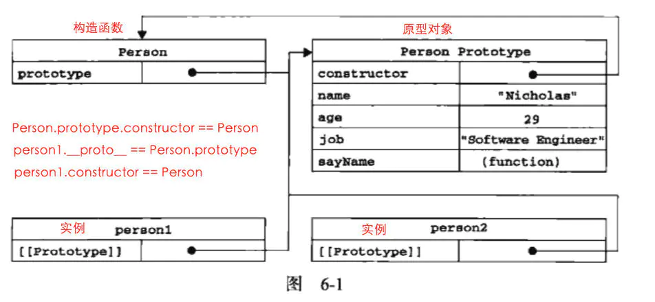

### 普通对象与函数对象

#### 简介

`JavaScript` 中，万物皆对象！但对象也是有区别的。分为普通对象和函数对象，`Object` 、`Function`是 `JS` 自带的函数对象

```js
  var o1 = {}; 
  var o2 =new Object();
  var o3 = new f1();

  function f1(){}; 
  var f2 = function(){};
  var f3 = new Function('str','console.log(str)');

  console.log(typeof Object); //function 
  console.log(typeof Function); //function  

  console.log(typeof f1); //function 
  console.log(typeof f2); //function 
  console.log(typeof f3); //function   

  console.log(typeof o1); //object 
  console.log(typeof o2); //object 
  console.log(typeof o3); //object
```

凡是通过 `new Function()` 创建的对象都是函数对象，其他的都是普通对象。f1,f2,归根结底都是通过 `new Function()`的方式进行创建的。`Function`、 `Object` 也都是通过 `New Function()`创建的。

#### 构造函数

**任何对象,方法都有构造函数属性 (constructor) 属性**
**实例的构造函数属性（constructor）指向构造函数**

1. 通过`Object` 方式创建的对象 其 构造函数属性 指向 `Object`

2. 通过 `new func` 方式创建的对象 其 构造函数属性 指向其构造函数 `func`

3. 函数的 构造函数属性 指向 `Function`

4. `class` 的 构造函数属性 指向 `Function`

```js
  let o1 = {}
  let o2 = Object.create({})

  console.log(o1.constructor === Object) // true
  console.log(o2.constructor === Object) // true

  function func() {}
  let f = new func()

  console.log(f.constructor === Object) // false
  console.log(f.constructor === func) // true
  console.log(func.constructor === Function) // true

  class B {}
  console.log(B.constructor === Function) // true
```

### 原型对象

每个函数对象都有一个 `prototype` 属性，这个属性指向函数的原型对象

每个对象都有 `__proto__`属性，但只有函数对象才有 `prototype` 属性

牢牢记住原型对象就是 `Person.prototype` 相当于 `js` 在创建函数时, 会自动创建一个对象 `Person.prototype.constructor == Person`(暂时理解),通过new生成的对象 的 `__proto__` 都指向 这个原型对象. 原型对象也就是这个函数的实例
```js
  person1.constructor == Person
  Person.prototype.constructor == Person
```

**也就是在 `Person` 创建的时候，创建了一个它的实例对象并赋值给它的 `prototype`**

**原型对象（Person.prototype）是 构造函数（Person）的一个实例。**

原型对象其实就是普通对象（但 `Function.prototype` 除外，它是函数对象，但它很特殊，他没有`prototype`属性（前面说道函数对象都有`prototype`属性）)

```js
  function Person(){};
  console.log(Person.prototype) //Person{}
  console.log(typeof Person.prototype) //Object
  console.log(typeof Function.prototype) // Function，这个特殊
  console.log(typeof Object.prototype) // Object
  console.log(typeof Function.prototype.prototype) //undefined
```

```js
  var A = new Function ();
  Function.prototype = A;
```

**上文提到凡是通过 `new Function()` 产生的对象都是函数对象。因为 `A` 是函数对象，所以`Function.prototype` 是函数对象。**


**`null` 是一个独立的数据类型,没有 `_proto_`，`typeof(null)`的值是`object` 是历史遗留问题**


### `_proto_`

`JS` 在创建对象（不论是普通对象还是函数对象）的时候，都有一个叫做`__proto__` 的内置属性，用于指向创建它的构造函数的原型对象。

对象 `person1` 有一个 `__proto__`属性，创建它的构造函数是 `Person`，构造函数的原型对象是 `Person.prototype` ，所以：`person1.__proto__ == Person.prototype`



这个连接存在于实例（`person1`）与构造函数（`Person`）的原型对象（`Person.prototype`）之间，而不是存在于实例（`person1`）与构造函数（`Person`）之间。

### 构造器

`var obj = {}` 等同于 `var obj = new Object()`
所以 `obj.constructor === Object`  `obj.__proto__ === Object.prototype`

构造器函数: `Function` `Object` `Date` `Array` `Number` `String` `Boolean`


**所有函数对象的proto都指向Function.prototype，它是一个空函数（Empty function）**

```js
  Number.__proto__ === Function.prototype  // true
  Number.constructor == Function //true

  Boolean.__proto__ === Function.prototype // true
  Boolean.constructor == Function //true

  String.__proto__ === Function.prototype  // true
  String.constructor == Function //true

  // 所有的构造器都来自于Function.prototype，甚至包括根构造器Object及Function自身
  Object.__proto__ === Function.prototype  // true
  Object.constructor == Function // true

  // 所有的构造器都来自于Function.prototype，甚至包括根构造器Object及Function自身
  Function.__proto__ === Function.prototype // true
  Function.constructor == Function //true

  Array.__proto__ === Function.prototype   // true
  Array.constructor == Function //true

  RegExp.__proto__ === Function.prototype  // true
  RegExp.constructor == Function //true

  Error.__proto__ === Function.prototype   // true
  Error.constructor == Function //true

  Date.__proto__ === Function.prototype    // true
  Date.constructor == Function //true
```

`JavaScript`中有内置(`build-in`)构造器/对象共计12个（`ES5`中新加了`JSON`），这里列举了可访问的8个构造器。剩下如`Global`不能直接访问，`Arguments`仅在函数调用时由`JS`引擎创建，`Math`，`JSON`是以对象形式存在的，无需`new`。它们的`__proto__`是`Object.prototype`。
```js
  Math.__proto__ === Object.prototype  // true
  Math.construrctor == Object // true

  JSON.__proto__ === Object.prototype  // true
  JSON.construrctor == Object //true
```
**所有的构造器都来自于 `Function.prototype`，甚至包括根构造器`Object`及`Function`自身。所有构造器都继承了·`Function.prototype`·的属性及方法。如length、`call`、`apply`、`bind`**


```js
  console.log(Function.prototype.__proto__ === Object.prototype) // true
  console.log(Object.__proto__ === Function.prototype) // true
```

这说明所有的构造器也都是一个普通 `JS` 对象，可以给构造器添加/删除属性等。同时它也继承了`Object.prototype`上的所有方法：`toString`、`valueOf`、`hasOwnProperty`等

**`Object.prototype.__proto__ === null` // true** 已经到顶了

### 原型对象

**函数的实例可以继承函数原型对象的所有方法**

```js
  console.log(Object.getOwnPropertyNames(Array.prototype))
  (34) ["length", "constructor", "concat", "copyWithin", "fill", "find", "findIndex", "lastIndexOf", "pop", "push", "reverse", "shift", "unshift", "slice", "sort", "splice", "includes", "indexOf", "join", "keys", "entries", "values", "forEach", "filter", "flat", "flatMap", "map", "every", "some", "reduce", "reduceRight", "toLocaleString", "toString", "flatten"]
```

数组也可以使用对象的方法.
```js
  Array.prototype.__proto__ == Object.prototype
```

**所有对象的 __proto__ 都指向其构造器的 prototype**

```js
  function Person(name) {
      this.name = name
  }
  // 修改原型
  Person.prototype.getName = function() {}
  var p = new Person('jack')
  console.log(p.__proto__ === Person.prototype) // true
  console.log(p.__proto__ === p.constructor.prototype) // true
```
可以看到`p.__proto__`与`Person.prototype`，`p.constructor.prototype`都是恒等的，即**都指向同一个对象**。

### 原型链
Function.prototype.constructor.prototype === Object.prototype //false ??
练习

1. `person1.__proto__` 是什么？
2. `Person.__proto__` 是什么？
3. `Person.prototype.__proto__` 是什么？
4. `Object.__proto__`是什么？
5. `Object.prototype__proto__` 是什么？

解: 
1. 因为 person1.__proto__ === person1 的构造函数.prototype
    因为 person1的构造函数 === Person
    所以 person1.__proto__ === Person.prototype

2. 因为 Person.__proto__ === Person的构造函数.prototype
因为 Person的构造函数 === Function
所以 Person.__proto__ === Function.prototype

3. Person.prototype 是一个普通对象，我们无需关注它有哪些属性，只要记住它是一个普通对象。
因为一个普通对象的构造函数 === Object
所以 Person.prototype.__proto__ === Object.prototype

4. 同第二题

5. Object.prototype 对象也有proto属性，但它比较特殊，为 null 。因为 null 处于原型链的顶端，这个只能记住。
Object.prototype.__proto__ === null


[原地址](https://www.jianshu.com/p/a4e1e7b6f4f8)