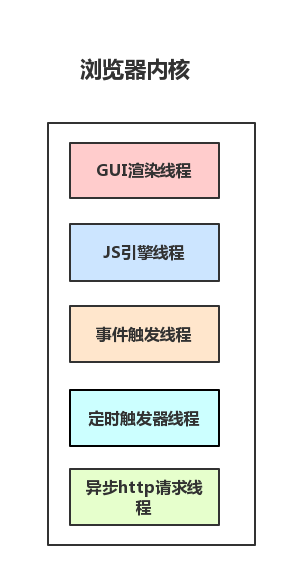
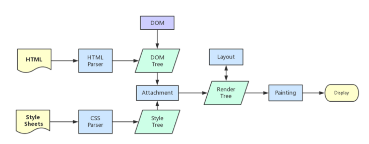

### 简述进程(`process`)、线程(`thread`)

+ 进程: 进程是cpu资源分配的最小单位（是能拥有资源和独立运行的最小单位）

+ 线程: 线程是cpu调度的最小单位（线程是建立在进程的基础上的一次程序运行单位，一个进程中可以有多个线程）

    - 不同进程之间也可以通信，不过代价较大
    - 现在，一般通用的叫法：单线程与多线程，都是指在一个进程内的单和多。（所以核心还是得属于一个进程才行）

---

### 浏览器的进程

#### 简单认知浏览器

1. 浏览器是多进程的
2. 浏览器之所以能够运行，是因为系统给它的进程分配了资源（cpu、内存）
3. 每打开一个Tab页，就相当于创建了一个独立的浏览器进程。

    **注意：每打开一个Tab页，就相当于创建了一个独立的浏览器进程。（所以每一个Tab标签对应一个进程并不一定是绝对的）**

#### 浏览器有哪些进程

1. `Browser`进程: 浏览器的主进程（负责协调、主控），**只有一个**。

    + 负责浏览器界面显示，与用户交互。如前进，后退等
    + 负责各个页面的管理，创建和销毁其他进程
    + 将`Renderer`进程得到的内存中的`Bitmap`，绘制到用户界面上
    + 网络资源的管理，下载等

2. `GPU`进程: **最多一个**，用于3D绘制等

3. 浏览器渲染进程（浏览器内核）（Renderer进程，内部是多线程的）: 默认每个Tab页面一个进程，互不影响。

    + 页面渲染，脚本执行，事件处理等

4. 第三方插件进程: 每种类型的插件对应一个进程，仅当使用该插件时才创建

    **简单理解: 在浏览器中打开一个网页相当于新起了一个进程`renderer`(进程内有自己的多线程)**

    **注意：浏览器有时会将多个进程合并（譬如打开多个空白标签页后，会发现多个空白标签页被合并成了一个进程）**

#### 浏览器多进程优缺点

1. 避免单个`page crash` 或者第三方插件`crash` 影响整个浏览器

2. 多进程可以充分利用多核优势

3. 方便使用沙盒模型隔离插件等进程，提高浏览器稳定性

    **简单理解：如果浏览器是单进程，那么某个Tab页崩溃了，就影响了整个浏览器，体验有多差；同理如果是单进程，插件崩溃了也会影响整个浏览器；**

    **缺点：多进程内存等资源消耗也会更大**

---

### 渲染进程(浏览器内核)(`renderer`进程)

#### 渲染进程内的线程

1. `GUI` 渲染线程

    + 负责渲染浏览器界面，解析`HTML`，`CSS`，构建`DOM`树和`RenderObject`树，布局和绘制等。
    + 当界面需要重绘（`Repaint`）或由于某种操作引发回流(`reflow`)时，该线程就会执行
    + **`GUI`渲染线程与`JS`引擎线程是互斥的**，当`JS`引擎执行时`GUI`线程会被挂起（相当于被冻结了），`GUI`更新会被保存在一个队列中等到`JS`引擎空闲时立即被执行。

2. `JS` 引擎线程

    + 也称为`JS`内核，负责解析处理`Javascript`脚本程序,运行代码。（例如V8引擎）
    + `JS`引擎一直等待着任务队列中任务的到来，然后加以处理，**一个`Tab`页（`renderer`进程）中无论什么时候都只有一个`JS`线程在运行`JS`程序**
    + **`GUI`渲染线程与`JS`引擎线程是互斥的**，所以如果`JS`执行的时间过长，这样就会造成页面的渲染不连贯，导致页面渲染加载阻塞。

3. 事件触发线程

    + **归属于浏览器而不是`JS`引擎**，用来控制事件循环（可以理解，`JS`引擎自己都忙不过来，需要浏览器另开线程协助）
    + 当`JS`引擎执行代码块如`setTimeOut`时（也可来自浏览器内核的其他线程,如鼠标点击、`AJAX`异步请求等），会将对应任务添加到事件线程中
    + 当对应的事件符合触发条件被触发时，该线程会把事件添加到待处理队列的队尾，等待`JS`引擎的处理
    + 由于JS的单线程关系，所以这些待处理队列中的事件都得排队等待`JS`引擎处理（当`JS`引擎空闲时才会去执行）

4. 定时触发器线程

    + `setInterval`与`setTimeout`所在线程
    + 浏览器定时计数器并不是由`JavaScript`引擎计数的,（因为`JavaScript`引擎是单线程的, 如果处于阻塞线程状态就会影响记计时的准确）
    + 因此通过单独线程来计时并触发定时（计时完毕后，添加到事件队列中，等待`JS`引擎空闲后执行）
    + `W3C`在`HTML`标准中规定，规定要求`setTimeout`中低于`4ms`的时间间隔算为`4ms`。

5. 异步`http`请求线程

    + 在`XMLHttpRequest`在连接后是通过浏览器新开一个线程请求
    + 将检测到状态变更时，如果设置有回调函数，异步线程就产生状态变更事件，将这个回调再放入事件队列中。再由`JavaScript`引擎执行。

---

### `Browser`进程跟浏览器内核(`renderer`进程)的通信

简介：如果打开一个浏览器 在任务管理器中就可以看到两个进程，一个是是浏览器主进程（`browser`进程），另一个是Tab页的渲染进程(浏览器内核)(`renderer`进程)

1. `Browser`进程收到用户请求，首先需要获取页面内容（譬如通过网络下载资源），随后将该任务通过`RendererHost`接口传递给`Render`进程

2. `Renderer`进程的`Renderer`接口收到消息，简单解释后，交给`GUI`渲染线程，然后开始渲染

    + `GUI`渲染线程接收请求，加载网页并渲染网页，这其中可能需要`Browser`进程获取资源和需要`GPU`进程来帮助渲染
    + 当然可能会有`JS`线程操作`DOM`（这样可能会造成回流并重绘）
    + 最后`Render`进程将结果传递给`Browser`进程

3. `Browser`进程接收到结果并将结果绘制出来

### 浏览器内核(renderer进程)中线程之间的关系

#### 简单介绍

1. `GUI`渲染线程与`JS`引擎线程互斥

    为了防止渲染出现不可预期(渲染过程中通过`Js`操作`DOM`)的结果，浏览器设置`GUI`渲染线程与`JS`引擎为互斥的关系，当`JS`引擎执行时`GUI`线程会被挂起，`GUI`更新则会被保存在一个队列中等到`JS`引擎线程空闲时立即被执行

2. `JS`阻塞页面加载

    `JS`如果执行时间过长就会阻塞页面。假设`JS`引擎正在进行巨量的计算，此时就算`GUI`有更新，也会被保存到队列中，等待`JS`引擎空闲后执行。要尽量避免`JS`执行时间过长，这样就会造成页面的渲染不连贯，导致页面渲染加载阻塞的感觉

3. `WebWorker`，`JS`的多线程？

    + 创建`Worker`时，`JS`引擎向浏览器申请开一个子线程（子线程是浏览器开的，完全受主线程控制，而且不能操作`DOM`）
    + `JS`引擎线程与`worker`线程间通过特定的方式通信（`postMessage API`，需要通过序列化对象来与线程交互特定的数据）

    **JS引擎是单线程的，这一点的本质仍然未改变，Worker可以理解是浏览器给JS引擎开的外挂，专门用来解决那些大量计算问题。**

4. `WebWorker`与`SharedWorker`

    + `WebWorker`只属于某个页面，不会和其他页面的`Render`进程（浏览器内核进程）共享
        - 所以`Chrome`在`Render`进程中（每一个`Tab`页就是一个`render`进程）创建一个新的线程来运行`Worker`中的`JavaScript`程序。
    + `SharedWorker`是浏览器所有页面共享的，不能采用与`Worker`同样的方式实现，因为它不隶属于某个`Render`进程，可以为多个`Render`进程共享使用
        - 所以`Chrome`浏览器为`SharedWorker`单独创建一个**进程**来运行`JavaScript`程序，在浏览器中每个相同的`JavaScript`只存在一个`SharedWorker`进程，不管它被创建多少次。

    本质上就是进程和线程的区别。`SharedWorker`由独立的进程管理，`WebWorker`只是属于`render`进程下的一个线程

### 浏览器渲染流程

#### 输入URL到页面显示 （待完善）

- 浏览器输入url，浏览器主进程接管，开一个下载线程，
然后进行 http请求（略去DNS查询，IP寻址等等操作），然后等待响应，获取内容，
随后将内容通过RendererHost接口转交给Renderer进程

- 浏览器渲染流程开始

#### 渲染进程的工作

1. 解析`html`建立`dom`树

2. 解析`css`构建`render`树（将`CSS`代码解析成树形的数据结构，然后结合`DOM`合并成`render`树）

3. 布局`render`树（`Layout/reflow`），负责各元素尺寸、位置的计算

4. 绘制`render`树（`paint`），绘制页面像素信息

5. 浏览器会将各层的信息发送给`GPU`，`GPU`会将各层合成（`composite`），显示在屏幕上。

详细步骤都已经略去，渲染完毕后就是`load`事件了，之后就是自己的`JS`逻辑处理了

#### `load`事件与`DOMContentLoaded`事件的先后

+ 当 `DOMContentLoaded` 事件触发时，仅当`DOM`加载完成，不包括样式表，图片

+ 当 `onload` 事件触发时，页面上所有的`DOM`，样式表，脚本，图片都已经加载完成了

#### css加载是否会阻塞dom树渲染?

**css是由单独的下载线程异步下载的**

`css`加载不会阻塞`DOM`树解析（异步加载时`DOM`照常构建）但会阻塞`render`树渲染（渲染时需等`css`加载完毕，因为`render`树需要`css`信息）

加载`css`的时候，可能会修改下面`DOM`节点的样式，如果`css`加载不阻塞`render`树渲染的话，那么当`css`加载完之后，`render`树可能又得重新重绘或者回流了，这就造成了一些没有必要的损耗。所以干脆就先把DOM树的结构先解析完，把可以做的工作做完，然后等你`css`加载完之后，在根据最终的样式来渲染`render`树，这种做法性能方面确实会比较好一点。

#### 普通图层与复合图层 (待完善)

渲染步骤中就提到了`composite`概念 浏览器渲染的图层一般包含两大类：`普通图层`以及`复合图层`

首先，普通文档流内可以理解为一个复合图层（这里称为`默认复合层`，里面不管添加多少元素，其实都是在同一个复合图层中）
其次，`absolute`布局（`fixed`也一样），虽然可以脱离普通文档流，但它仍然属于`默认复合层`。

然后，可以通过**硬件加速**的方式，声明一个新的复合图层，它会单独分配资源（当然也会脱离普通文档流，这样一来，不管这个复合图层中怎么变化，也不会影响默认复合层里的回流重绘）

简单理解下：`GPU`中，各个复合图层是单独绘制的，所以互不影响，

### Event Loop (事件循环)

**此时 浏览器页面已经初次渲染完毕。**

#### 可执行上下文，VO，scop chain （待完善）

#### 事件循环简单理解

1. `JS`分为同步任务和异步任务

2. 同步任务都在主线程上执行，形成一个`执行栈`

3. 主线程之外，**事件触发线程**管理着一个`任务队列`，只要异步任务有了运行结果   ，就在`任务队列`之中放置一个事件

4. 一旦执行栈中的所有同步任务执行完毕（此时`JS`引擎空闲），系统就会读取任务队列，将可运行的异步任务添加到可执行栈中，开始执行。

为什么有时候`setTimeout`推入的事件不能准时执行？因为可能在它推入到事件列表时，主线程还不空闲，正在执行其它代码

+ 主线程运行时会产生执行栈

+ 栈中的代码调用某些api时，（当满足触发条件后，如ajax请求完毕）它们会在事件队列中添加各种事件

+ 而栈中的代码执行完毕，就会读取事件队列中的事件，去执行那些回调(注意，总是要等待栈中的代码执行完毕后才会去读取事件队列中的事件)

+ 如此循环

#### 定时器

当使用`setTimeout`或`setInterval`时，它需要定时器线程计时，计时完成后就会将特定的事件推入事件队列中
`W3C`在`HTML`标准中规定，规定要求`setTimeout`中低于`4ms`的时间间隔算为`4ms`。

`setTimeout`与`setInterval` 区别
`setTimeout`模拟定期计时
1. 每次`setTimeout`计时到后就会去执行，然后执行一段时间后才会继续`setTimeout`，中间就多了误差（误差多少与代码执行时间有关）

2. `setInterval`则是每次都精确的隔一段时间推入一个事件（但是，事件的实际执行时间不一定就准确，还有可能是这个事件还没执行完毕，下一个事件就来了）

    + 而且把浏览器最小化显示等操作时，`setInterval`并不是不执行程序，

如果`setInterval`代码在（`setInterval`）再次添加到队列之前还没有完成执行，就会导致定时器代码连续运行好几次，而之间没有间隔

就算正常间隔执行，多个`setInterval`的代码执行时间可能会比预期小（**因为代码执行需要一定时间**）

JS高程中有提到，`JS`引擎会对`setInterval`进行优化，如果当前事件队列中有`setInterval`的回调，不会重复添加。

### 微任务(`microtask`)与宏任务(`macrotask`)

https://segmentfault.com/a/1190000012925872
