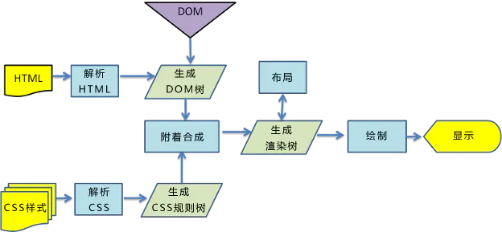

用户看到页面实际上可以分为两个阶段：页面内容加载完成和页面资源加载完成，分别对应于`DOMContentLoaded`和`Load`。

1. `DOMContentLoaded`事件触发时，仅当DOM加载完成，不包括样式表，图片等(DOM树构建完成)
2. `load`事件触发时，页面上所有的DOM，样式表，脚本，图片都已加载完成

都可以被 `document.addEventListener` 监听到

#### GUI线程渲染过程

从图中可以看出，一个渲染引擎大致包括`HTML`解释器、`CSS`解释器、布局和`JavaScript`引擎。

`HTML`解释器：解释`HTML`语言的解释器，本质是将`HTML`文本解释成`DOM`树（文档对象模型）。

`CSS`解释器：解释样式表的解释器，其作用是将`DOM`中的各个元素对象加上样式信息，从而为计算最后结果的布局提供依据。

布局：将`DOM`和`css`样式信息结合起来，计算它们的大小位置等布局信息，形成一个能够表示这所有信息的内部表示模型即渲染树。

这些模块依赖很多其他的基础模块，这其中包括网络，存储，2D/3D图形，音频视频和图片解码器等。实际上，渲染引擎中还应该包括如何使用这些依赖模块的部分，这部分的工作其实并不少，因为需要使用它们来高效的渲染网页。例如，利用2D/3D图形库来实现高性能的网页绘制和网页的3D渲染，这个实现非常非常的复杂。最后，当然，在最下面，依然少不了操作系统的支持，例如线程支持，文件支持等等。

1. 浏览器将获取的`HTML`文档解析成`DOM`树。

2. 处理`CSS`标记，构成层叠样式表模型`CSSOM`(`CSS Object Model`)。

3. 将`DOM`和`CSSOM`合并为渲染树(`rendering tree`)，代表一系列将被渲染的对象。

4. 渲染树的每个元素包含的内容都是计算过的，它被称之为布局`layout`。浏览器使用一种流式处理的方法，只需要一次绘制操作就可以布局所有的元素。

5. 将渲染树的各个节点绘制到屏幕上，这一步被称为绘制`painting`。

需要注意的是，以上五个步骤并不一定一次性顺序完成，比如`DOM`或`CSSOM`被修改时，亦或是哪个过程会重复执行，这样才能计算出哪些像素需要在屏幕上进行重新渲染。而在实际情况中，`JavaScript`和`CSS`的某些操作往往会多次修改`DOM`或者`CSSOM`。

#### 浏览器渲染网页的具体流程

构建`DOM`树

当浏览器接收到服务器响应来的HTML文档后，会遍历文档节点，生成`DOM`树。
需要注意以下几点：

1. `DOM`树在构建的过程中可能会被`JS`的加载而执行阻塞

2. `display:none`的元素也会在`DOM`树中

3. 注释也会在`DOM`树中

4. `script`标签会在`DOM`树中

无论是`DOM`还是`CSSOM`，都是要经过`Bytes→characters→tokens→nodes→object model`这个过程。

当前节点的所有子节点都构建好后才会去构建当前节点的下一个兄弟节点

#### 构建CSSOM树

浏览器解析`CSS`文件并生成`CSSOM`，每个`CSS`文件都被分析成一个`StyleSheet`对象，每个对象都包含`CSS`规则。`CSS`规则对象包含对应于`CSS`语法的选择器和声明对象以及其他对象

1. `CSS`解析可以与`DOM`解析同时进行。

2. `CSS`解析与`script`的执行互斥 。

3. 在`Webkit`内核中进行了`script`执行优化，只有在`JS`访问`CSS`时才会发生互斥。

#### 构建渲染树

通过`DOM`树和`CSS`规则树，浏览器就可以通过它两构建渲染树了。浏览器会先从`DOM`树的根节点开始遍历每个可见节点，然后对每个可见节点找到适配的`CSS`样式规则并应用

1. `Render Tree`和`DOM Tree`不完全对应

2. `display: none`的元素不在`Render Tree`中

3. `visibility: hidden`的元素在`Render Tree`中

渲染树生成后，还是没有办法渲染到屏幕上，渲染到屏幕需要得到各个节点的位置信息，这就需要布局（`Layout`）的处理了

#### 渲染树布局

布局阶段会从渲染树的根节点开始遍历，由于渲染树的每个节点都是一个Render Object对象，包含宽高，位置，背景色等样式信息。所以浏览器就可以通过这些样式信息来确定每个节点对象在页面上的确切大小和位置，布局阶段的输出就是我们常说的盒子模型，它会精确地捕获每个元素在屏幕内的确切位置与大小

1. `float`元素，`absoulte`元素，`fixed`元素会发生位置偏移。

2. 我们常说的脱离文档流，其实就是脱离`Render Tree`。

#### 渲染树绘制

在绘制阶段，浏览器会遍历渲染树，调用渲染器的`paint()`方法在屏幕上显示其内容。渲染树的绘制工作是由浏览器的UI后端组件完成的.

#### 渲染阻塞

由于`CSSOM`负责存储渲染信息，浏览器就必须保证在合成渲染树之前，`CSSOM`是完备的，这种完备是指所有的`CSS`（内联、内部和外部）都已经下载完，并解析完，只有`CSSOM`和`DOM`的解析完全结束，浏览器才会进入下一步的渲染，这就是`CSS`阻塞渲染。

`CSS`阻塞渲染意味着，在`CSSOM`完备前，页面将一直处于白屏状态，这就是为什么样式放在`head`中，仅仅是为了更快的解析`CSS`，保证更快的首次渲染。

需要注意的是，即便你没有给页面任何的样式声明，`CSSOM`依然会生成，默认生成的`CSSOM`自带浏览器默认样式

当解析`HTML`的时候，会把新来的元素插入`DOM`树里面，同时去查找`CSS`，然后把对应的样式规则应用到元素上，查找样式表是按照从右到左的顺序去匹配的。

例如：`div p {font-size: 16px}`，会先寻找所有`p`标签并判断它的父标签是否为`div`之后才会决定要不要采用这个样式进行渲染）。
所以，我们平时写`CSS`时，尽量用`id`和`class`，千万不要过渡层叠。

#### 重排与重绘(reflow回流, repaint)

1. 重绘(`repaint`) 重绘是改变不影响元素在网页中的位置的元素样式时，譬如background-color(背景色)， border-color(边框色)， visibility(可见性)，浏览器会根据元素的新属性重新绘制一次(这就是重绘，或者说重新构造样式)，使元素呈现新的外观。重绘不会带来重新布局，所以并不一定伴随重排。

2. 重排(`Reflow`) 渲染对象在创建完成并添加到渲染树时，并不包含位置和大小信息。计算这些值的过程称为布局或重排当改变影响到文本内容或结构，或者元素位置时，重排或者说重新布局就会发生

    + `DOM`操作（元素添加、删除、修改或者元素顺序的改变）
    + 内容变化，包括表单域内的文本改变
    + `CSS`属性的计算或改变
    + 添加或删除样式表
    + 更改“类”的属性
    + 浏览器窗口的操作（缩放，滚动）
    + 伪类激活（悬停）
    + 页面第一次渲染（初始化）
    + DOM树变化（如：增删节点）
    + Render树变化（如：padding改变）
    + 浏览器窗口resize
    + 获取元素的某些属性

"重绘"不一定需要"重排"，比如改变某个网页元素的颜色，就只会触发"重绘"，不会触发"重排"，因为布局没有改变。

但是，"重排"必然导致"重绘"，比如改变一个网页元素的位置，就会同时触发"重排"和"重绘"，因为布局改变了。

+ 用`transform`做形变和位移可以减少`reflow`

+ 避免逐个修改节点样式，尽量一次性修改

+ 使用`DocumentFragment`将需要多次修改的`DOM`元素缓存，最后一次性`append`到真实`DOM`中渲染

+ 可以将需要多次修改的DOM元素设置`display:none`，操作完再显示。（因为隐藏元素不在`render`树内，因此修改隐藏元素不会触发回流重绘）

+ 避免多次读取某些属性

+ 通过绝对位移将复杂的节点元素脱离文档流，形成新的`Render Layer`，降低回流成本

+ 样式文件应当在`head`标签中，而脚本文件在`body`结束前，这样可以防止阻塞的方式

+ 简化并优化`CSS`选择器，尽量将嵌套层减少到最小

+ `DOM` 的多个读操作（或多个写操作），应该放在一起。不要两个读操作之间，加入一个写操作。

+ 不要一条条地改变样式，而要通过改变`class`，或者`csstext`属性，一次性地改变样式

+ 尽量使用离线`DOM`，而不是真实的网页`DOM`，来改变元素样式。比如，操作`Document Fragment`对象，完成后再把这个对象加入`DOM`。再比如，使用`cloneNode()`方法，在克隆的节点上进行操作，然后再用克隆的节点替换原始节点

1. 将多次改变样式属性的操作合并成一次操作

2. 将需要多次重排的元素，`position`属性设为`absolute`或`fixed`脱离普通文档流

3. 由于`display`属性为`none`的元素不在渲染树中，对隐藏的元素操作不会引发其他元素的重排

    如果要对一个元素进行复杂的操作时，可以先隐藏它，操作完成后再显示。这样只在隐藏和显示时触发2次重排
    

`display:none`:
隐藏元素，不占网页中的任何空间，让这个元素彻底消失（看不见也摸不着）,由于会影响到网页的空间，所以会引起一次重排和重绘。

`visibility:hidden`:
他是把那个层隐藏了，也就是你看不到它的内容但是它内容所占据的空间还是存在的。（看不见但摸得到），该操作不会对页面有影响，所以只会引起一次重绘。

`overflow:hidden`:
让超出的元素隐藏（不占据网页空间），就是在设置该属性的时候他会根据你设置的宽高把多余的那部分剪掉，会引起一次重排和重绘。

[原地址](https://www.jianshu.com/p/e6252dc9be32)