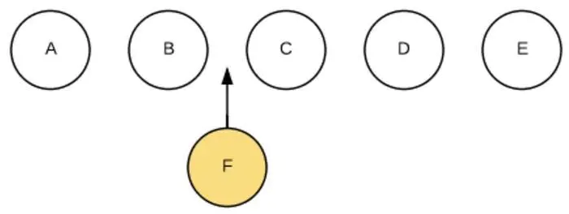

### JS 操作 DOM 的代价

原生JS或JQ操作DOM时，浏览器会从构建DOM树开始从头到尾执行一遍流程。在一次操作中，我需要更新10个DOM节点，浏览器收到第一个DOM请求后并不知道还有9次更新操作，因此会马上执行流程，最终执行10次


### 虚拟 DOM 作用

虚拟DOM就是为了解决浏览器性能问题而被设计出来的。如前，若一次操作中有10次更新DOM的动作，虚拟DOM不会立即操作DOM，而是将这10次更新的diff内容保存到本地一个JS对象中，最终将这个JS对象一次性attch到DOM树上，再进行后续操作，避免大量无谓的计算量。

### 实现虚拟 DOM

真实 `DOM` 节点
```html
  <div class="real-container">
  <p>real DOM</p>
  <div>cannot update</div>
  <ul>
    <li class="item">item1</li>
    <li class="item">item2</li>
    <li class="item">item3</li>
  </ul>
</div>
```

通过 `js` 模拟 `DOM` 节点 实现虚拟 `DOM`

```js
  // 构建 VNODE 节点的方法
  function Element(tagName, props, children) {
    // 判断是否是 Element 实例
    if (!(this instanceof Element)) {
      return new Element(tagName, props, children);
    }

    this.tagName = tagName;
    this.props = props || {};
    this.children = children || [];
    this.key = props ? props.key : undefined

    let count = 0;
    this.children.forEacn(child => {
      if (child instanceof Element) {
        count += child.count;
      }
      count++ ;
    })
    this.count = count;
  }

  // 构建 后的DOM
  const tree = Element('div', { id: 'virtual-container' }, [
    Element('p', {}, ['Virtual DOM']),
    Element('div', {}, ['before update']),
    Element('ul', {}, [
      Element('li', { class: 'item' }, ['item 1']),
      Element('li', { class: 'item' }, ['item 2']),
      Element('li', { class: 'item' }, ['item 3']),
    ]),
  ])

  const root = tree.render();
  document.body.appendChild(root)
```


### Diff 算法

对新旧两棵树进行一个深度的遍历，每个节点都会有一个标记。每遍历到一个节点就把该节点和新的树进行对比，如果有差异就记录到一个对象中

平层 `diff`

1. 节点类型变了，例如P变成了H3。我们将这个过程称之为`REPLACE`。直接将旧节点卸载并装载新节点。旧节点包括下面的子节点都将被卸载，如果新节点和旧节点仅仅是类型不同，但下面的所有子节点都一样时，这样做效率不高。但为了避免O(n^3)的时间复杂度，这样是值得的。这也提醒了开发者，应该避免无谓的节点类型的变化，例如运行时将div变成p没有意义。

2. 节点类型一样，仅仅属性或属性值变了。我们将这个过程称之为`PROPS`。此时不会触发节点卸载和装载，而是节点更新

3. 文本变了，文本对也是一个`Text Node`，也比较简单，直接修改文字内容就行了，我们将这个过程称之为`TEXT`。

4. 移动／增加／删除 子节点，我们将这个过程称之为`REORDER`




 我们简单粗暴的做法是遍历每一个新虚拟DOM的节点，与旧虚拟DOM对比相应节点对比，在旧DOM中是否存在，不同就卸载原来的按上新的。这样会对F后边每一个节点进行操作。卸载C，装载F，卸载D，装载C，卸载E，装载D，装载E。效率太低。

  如果我们在JSX里为数组或枚举型元素增加上`key`后，它能够根据`key`，直接找到具体位置进行操作，效率比较高

### 映射真实 DOM

我们会有两个虚拟DOM(js对象，new/old进行比较diff)，用户交互我们操作数据变化new虚拟DOM，old虚拟DOM会映射成实际DOM(js对象生成的DOM文档)通过DOM fragment操作给浏览器渲染。当修改new虚拟DOM，会把newDOM和oldDOM通过diff算法比较，得出diff结果数据表(用4种变换情况表示)。再把diff结果表通过DOM fragment更新到浏览器DOM中。


[原地址](https://www.jianshu.com/p/af0b398602bc)
https://www.cnblogs.com/liandudu/p/14276856.html